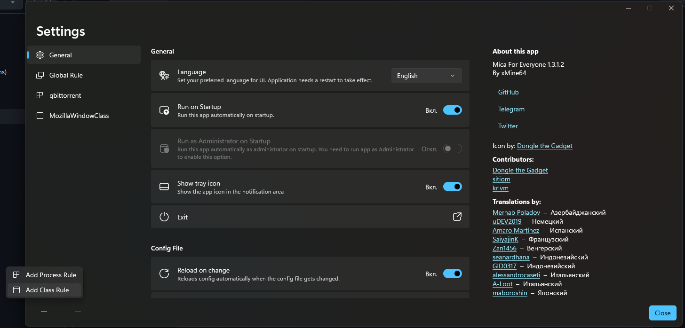

# Mica for floorp
userChrome.css for floorp which adds a support for "mica for everyone"

## Requirements
- Mica For Everyone
- Floorp browser

## Download
Download theme [userChrome.css](https://github.com/awesfdawe/floorp-mica-userChrome.css/blob/main/userChrome.css) and download Mica for Everyone [here.](https://github.com/MicaForEveryone/MicaForEveryone/releases/) 

## Using
First, go to settings `Floorp` > `Design` and enable `Allow Mica For Everyone to modify the browser design`, then open your profile folder (its location can be found in `about:profiles`), navigate to the `chrome` folder and replace `userChrome.css` with the downloaded one
If you want the theme to work correctly use these Mica for Everyone settings:

<b>Mica for Everyone settings</b>

  

  

  

##### Note: In case you find that MicaForEveryone app is making other unwanted changes to your PC's look and feel, simply go to all other rules listed and select Default in drop-down menu for all options given and toggle other options to Off.
##### In case mica themes act like normal themes after computer restarts, make sure to toggle on `Run on Startup` setting in `General` tab

## Mica for floorp

<b>Horizontal and vertical tab panel with Acrylic effect</b>

<b>Horizontal and vertical tab panel with Mica effect</b>

